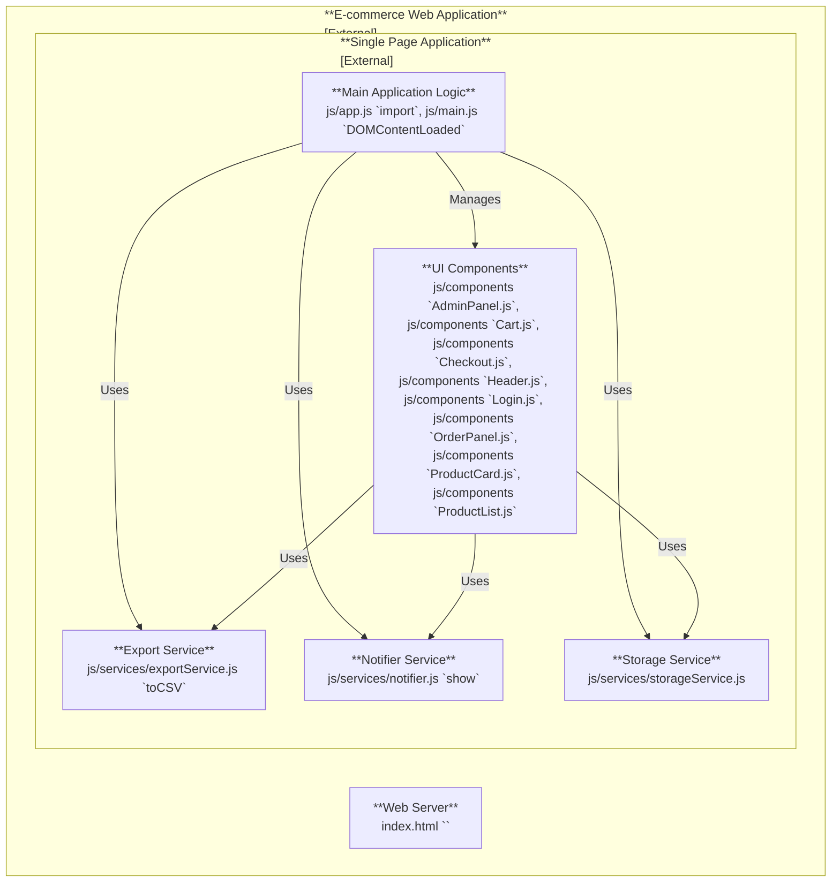

# Unnamed CodeViz Diagram

```mermaid
graph TD

    subgraph base.cv::ecommerce_app["**E-commerce Web Application**<br>[External]"]
        base.cv::web_server["**Web Server**<br>index.html `<!DOCTYPE html>`"]
        subgraph base.cv::spa["**Single Page Application**<br>[External]"]
            base.cv::main_app["**Main Application Logic**<br>js/app.js `import`, js/main.js `DOMContentLoaded`"]
            base.cv::ui_components["**UI Components**<br>js/components `AdminPanel.js`, js/components `Cart.js`, js/components `Checkout.js`, js/components `Header.js`, js/components `Login.js`, js/components `OrderPanel.js`, js/components `ProductCard.js`, js/components `ProductList.js`"]
            base.cv::export_service["**Export Service**<br>js/services/exportService.js `toCSV`"]
            base.cv::notifier_service["**Notifier Service**<br>js/services/notifier.js `show`"]
            base.cv::storage_service["**Storage Service**<br>js/services/storageService.js"]
            %% Edges at this level (grouped by source)
            base.cv::main_app["**Main Application Logic**<br>js/app.js `import`, js/main.js `DOMContentLoaded`"] -->|"Manages"| base.cv::ui_components["**UI Components**<br>js/components `AdminPanel.js`, js/components `Cart.js`, js/components `Checkout.js`, js/components `Header.js`, js/components `Login.js`, js/components `OrderPanel.js`, js/components `ProductCard.js`, js/components `ProductList.js`"]
            base.cv::main_app["**Main Application Logic**<br>js/app.js `import`, js/main.js `DOMContentLoaded`"] -->|"Uses"| base.cv::export_service["**Export Service**<br>js/services/exportService.js `toCSV`"]
            base.cv::main_app["**Main Application Logic**<br>js/app.js `import`, js/main.js `DOMContentLoaded`"] -->|"Uses"| base.cv::notifier_service["**Notifier Service**<br>js/services/notifier.js `show`"]
            base.cv::main_app["**Main Application Logic**<br>js/app.js `import`, js/main.js `DOMContentLoaded`"] -->|"Uses"| base.cv::storage_service["**Storage Service**<br>js/services/storageService.js"]
            base.cv::ui_components["**UI Components**<br>js/components `AdminPanel.js`, js/components `Cart.js`, js/components `Checkout.js`, js/components `Header.js`, js/components `Login.js`, js/components `OrderPanel.js`, js/components `ProductCard.js`, js/components `ProductList.js`"] -->|"Uses"| base.cv::export_service["**Export Service**<br>js/services/exportService.js `toCSV`"]
            base.cv::ui_components["**UI Components**<br>js/components `AdminPanel.js`, js/components `Cart.js`, js/components `Checkout.js`, js/components `Header.js`, js/components `Login.js`, js/components `OrderPanel.js`, js/components `ProductCard.js`, js/components `ProductList.js`"] -->|"Uses"| base.cv::notifier_service["**Notifier Service**<br>js/services/notifier.js `show`"]
            base.cv::ui_components["**UI Components**<br>js/components `AdminPanel.js`, js/components `Cart.js`, js/components `Checkout.js`, js/components `Header.js`, js/components `Login.js`, js/components `OrderPanel.js`, js/components `ProductCard.js`, js/components `ProductList.js`"] -->|"Uses"| base.cv::storage_service["**Storage Service**<br>js/services/storageService.js"]
        end
    end

```
---
*Generated by [CodeViz.ai](https://codeviz.ai) on 18/4/2026, 14:12:35*
